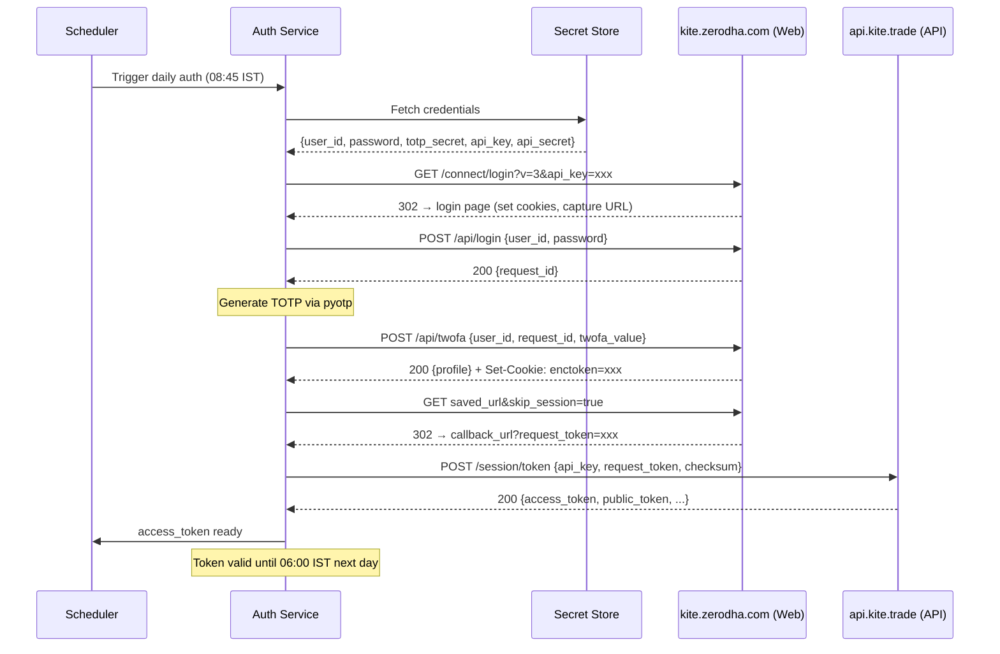

# Zerodha Kite Daily Access-Token Automation — Technical Specification

## Table of Contents

1. [Architecture Overview](#1-architecture-overview)
2. [Request/Response Sequence](#2-requestresponse-sequence)
3. [Data Flow and State](#3-data-flow-and-state)
4. [Two Implementation Approaches](#4-two-implementation-approaches)
5. [Security Model](#5-security-model)
6. [Breakage Risks](#6-breakage-risks)
7. [Compliance and Policy](#7-compliance-and-policy)
8. [Implementation Plan](#8-implementation-plan)
9. [Final Recommendation](#9-final-recommendation)

---

## 1. Architecture Overview

### Official vs Unofficial Flow

The **official Kite Connect OAuth flow** requires a human to open a browser, log in to Zerodha, complete 2FA, and be redirected to a callback URL with a `request_token`. This is by design — Indian exchanges (NSE/BSE) mandate that traders log in manually at least once per day.

The **unofficial automation flow** replaces the browser interaction with direct HTTP calls to Zerodha's internal web login endpoints (`/api/login` and `/api/twofa`), which are the same endpoints the Kite web app uses under the hood. These are **not part of the documented Kite Connect API** and can change without notice.

### End-to-End Sequence (Cold Start → Valid Access Token)

```
┌─────────────────────────────────────────────────────────────────────────┐
│                        COLD START (e.g., 8:45 AM IST)                  │
└─────────────────────────────────────────────────────────────────────────┘
        │
        ▼
┌───────────────────┐     ┌──────────────────────┐
│  Load Secrets     │────▶│  api_key, api_secret  │
│  from Vault/Env   │     │  user_id, password    │
│                   │     │  totp_secret          │
└───────────────────┘     └──────────────────────┘
        │
        ▼
┌───────────────────┐     GET kite.trade/connect/login?v=3&api_key=xxx
│  1. Init Session  │────▶ Establishes cookies, captures redirect URL
│  (requests.Session)│
└───────────────────┘
        │
        ▼
┌───────────────────┐     POST kite.zerodha.com/api/login
│  2. Submit Creds  │────▶ Body: {user_id, password}
│                   │◀──── Response: {request_id}
└───────────────────┘
        │
        ▼
┌───────────────────┐     pyotp.TOTP(secret).now() → 6-digit code
│  3. Generate TOTP │
└───────────────────┘
        │
        ▼
┌───────────────────┐     POST kite.zerodha.com/api/twofa
│  4. Submit 2FA    │────▶ Body: {user_id, request_id, twofa_value}
│                   │◀──── Response: {profile data} + enctoken cookie
└───────────────────┘
        │
        ▼
┌───────────────────┐     GET saved_url + "&skip_session=true"
│  5. Follow Redir  │────▶ Server recognizes auth session → 302 redirect
│                   │◀──── Location: callback_url?request_token=xxx
└───────────────────┘
        │
        ▼
┌───────────────────┐     POST api.kite.trade/session/token
│  6. Exchange Token│────▶ Body: {api_key, request_token, checksum}
│                   │◀──── Response: {access_token, public_token, ...}
└───────────────────┘
        │
        ▼
┌───────────────────┐
│  7. Persist Token │────▶ Save access_token to file/cache
│     Start Trading │     Valid until 6:00 AM IST next day
└───────────────────┘
```

### Sequence Diagram (Mermaid)



---

## 2. Request/Response Sequence

### Step 1: Initialize Session and Capture Login URL

```
GET https://kite.trade/connect/login?v=3&api_key={api_key}
```

| Aspect | Detail |
|--------|--------|
| **Purpose** | Establish browser-like session cookies; capture the redirect URL for later |
| **Request headers** | Standard browser User-Agent recommended |
| **Response** | 302 redirect → `https://kite.zerodha.com/connect/login?v=3&api_key=xxx&sess_id=yyy` |
| **Side effects** | Session cookies set (`kf_session`, Cloudflare cookies) |
| **What to save** | The final URL after redirect (needed in Step 5) |

### Step 2: POST Login Credentials

```
POST https://kite.zerodha.com/api/login
Content-Type: application/x-www-form-urlencoded

user_id=XX1234&password=yourpassword
```

| Aspect | Detail |
|--------|--------|
| **Purpose** | First factor authentication (password) |
| **Required fields** | `user_id` (Zerodha client ID), `password` (Zerodha login password) |
| **Success response** | `{"status": "success", "data": {"request_id": "uuid-string", "user_id": "XX1234"}}` |
| **Error response** | `{"status": "error", "message": "Invalid user id or password"}` |
| **Side effects** | Session receives additional auth-state cookies |
| **What to save** | `request_id` from `data.request_id` |

**Important**: No CSRF token is required for this endpoint. The session cookies alone handle CSRF protection.

### Step 3: Generate TOTP

```python
import pyotp
totp_value = pyotp.TOTP(totp_secret).now()  # → "482931" (6-digit string)
```

| Aspect | Detail |
|--------|--------|
| **Standard** | RFC 6238 TOTP |
| **Algorithm** | SHA-1 (default, Google Authenticator compatible) |
| **Digits** | 6 |
| **Time step** | 30 seconds |
| **Secret format** | Base32-encoded string |
| **Library** | `pyotp` (preferred) or `onetimepass` |

**Note**: No custom parameters needed — `pyotp.TOTP()` defaults match Zerodha's requirements exactly.

### Step 4: POST 2FA (TOTP)

```
POST https://kite.zerodha.com/api/twofa
Content-Type: application/x-www-form-urlencoded

user_id=XX1234&request_id={from_step_2}&twofa_value=482931
```

| Aspect | Detail |
|--------|--------|
| **Purpose** | Second factor authentication (TOTP) |
| **Required fields** | `user_id`, `request_id` (from Step 2), `twofa_value` (6-digit TOTP) |
| **Optional fields** | `twofa_type=totp` (some implementations include this), `skip_session=true` (some include this) |
| **Success response** | `{"status": "success", "data": {"profile": {...}}}` |
| **Error response** | `{"status": "error", "message": "Invalid twofa value"}` |
| **Side effects** | `enctoken` cookie set on session — this is the web session auth token |
| **What to save** | Nothing explicit — the session cookies now carry full auth state |

### Step 5: Follow Redirect to Extract request_token

```
GET {saved_url_from_step_1}&skip_session=true
```

| Aspect | Detail |
|--------|--------|
| **Purpose** | Trigger the OAuth redirect now that the session is authenticated |
| **Mechanism** | Kite server sees authenticated session cookies → issues 302 to registered callback URL |
| **Redirect target** | `https://your-callback-url?request_token=xxx&action=login&status=success` |
| **Extraction** | Parse `request_token` from the query string of the final URL |
| **Edge case** | If callback URL is `localhost` and not listening, use `allow_redirects=False` and extract from `Location` header |

**Three known extraction patterns**:

| Pattern | Method | Resilience |
|---------|--------|------------|
| URL parse with `allow_redirects=True` | `parse_qs(urlparse(response.url).query)['request_token'][0]` | Most resilient |
| Location header with `allow_redirects=False` | `response.headers['Location']` → parse | Works when callback is unreachable |
| Regex on error message | `re.findall(r'request_token=([A-Za-z0-9]+)', str(e))` | Fragile fallback |

### Step 6: Exchange request_token for access_token

```
POST https://api.kite.trade/session/token
Content-Type: application/x-www-form-urlencoded
X-Kite-Version: 3

api_key={api_key}&request_token={request_token}&checksum={sha256(api_key + request_token + api_secret)}
```

| Aspect | Detail |
|--------|--------|
| **Purpose** | Exchange one-time request_token for a day-long access_token |
| **Checksum** | SHA-256 hash of concatenation: `api_key + request_token + api_secret` (no delimiters) |
| **Success response** | `{"status":"success","data":{"user_id":"XX1234","access_token":"xxx","public_token":"xxx","login_time":"..."}}` |
| **This is official API** | Yes — this endpoint is part of the documented Kite Connect API |
| **Library shortcut** | `kite.generate_session(request_token, api_secret=api_secret)` handles checksum + POST |

### Step 7: Use access_token

All subsequent Kite Connect API calls use the header:
```
Authorization: token {api_key}:{access_token}
```

Token is valid until **6:00 AM IST the next day**.

---

## 3. Data Flow and State

### Credential Lifecycle Table

| Credential | Source | Used In | Lifespan | One-Time Use? | Storage Risk |
|------------|--------|---------|----------|---------------|--------------|
| `api_key` | Kite Developer Console | Steps 1, 6, all API calls | Until rotated manually | No | Low (semi-public) |
| `api_secret` | Kite Developer Console | Step 6 (checksum) | Until rotated manually | No | **High** (never expose) |
| `user_id` | Zerodha account | Steps 2, 4 | Permanent | No | Low |
| `password` | Zerodha account | Step 2 | Until changed | No | **Critical** |
| `totp_secret` | 2FA setup QR code | Step 3 (TOTP generation) | Until 2FA reset | No | **Critical** (nullifies 2FA) |
| `request_id` | Step 2 response | Step 4 | Minutes | Yes | Ephemeral |
| `twofa_value` | pyotp generation | Step 4 | 30 seconds | Yes | Ephemeral |
| `enctoken` | Step 4 response cookie | (Alternative API approach) | Until 6 AM IST next day | No | Medium |
| `request_token` | Step 5 redirect URL | Step 6 | Few minutes | **Yes** (single use) | Ephemeral |
| `access_token` | Step 6 response | All API calls for the day | Until 6 AM IST next day | No | **High** |

### State Preservation Requirements

| State | Must Persist Across Steps? | Must Persist Across Days? |
|-------|---------------------------|--------------------------|
| `requests.Session` cookies | Yes (Steps 1→5) | No |
| `request_id` | Yes (Step 2→4) | No |
| `request_token` | Yes (Step 5→6) | No |
| `access_token` | No (but should be cached) | No (expires at 6 AM) |
| Secrets (password, totp_secret, api_secret) | N/A | Yes (persistent storage) |

### Expiry and Invalidation

| Item | Expires | Can Be Invalidated Early? |
|------|---------|--------------------------|
| `access_token` | 6:00 AM IST next day | Yes — via `DELETE /session/token` or master logout from Kite Web |
| `enctoken` | 6:00 AM IST next day | Yes — via web logout |
| `request_token` | ~2–5 minutes after issuance | Yes — once exchanged for access_token |
| `request_id` | ~2–5 minutes after issuance | Yes — once used in 2FA step |
| TOTP code | 30 seconds | N/A |

---

## 4. Two Implementation Approaches

### Approach A: Pure HTTP Automation (`requests.Session`)

**How it works**: Direct HTTP POST/GET calls to Zerodha's internal web endpoints using Python's `requests` library. No browser needed.

```
requests.Session() → GET login URL → POST /api/login → POST /api/twofa → GET redirect → generate_session()
```

| Dimension | Assessment |
|-----------|------------|
| **Advantages** | Lightweight (~50 lines of code). No browser binary needed. Fast execution (~2-3 seconds). Low resource footprint. Easy to containerize. |
| **Failure modes** | Endpoint URL changes break it silently. Cloudflare captcha on cloud IPs. TOTP time drift. Rate limiting after failed attempts. Request body format changes. |
| **Maintainability** | Simple code, but requires monitoring for breakage. No way to detect changes proactively — you only know it broke when login fails. |
| **Bot detection fragility** | **Medium risk**. Cloudflare can challenge requests from datacenter IPs. Residential/office IPs generally work fine. No browser fingerprinting to worry about. |
| **Operational complexity** | Low. Single Python script. Only dependency beyond stdlib is `requests`, `pyotp`, `kiteconnect`. |

**When it breaks**: The script returns an HTTP error or unexpected JSON. Common failure: Cloudflare returns HTML instead of JSON when captcha is triggered.

### Approach B: Browser Automation (Selenium / Playwright)

**How it works**: Drives a headless browser (Chrome/Firefox) through the actual Kite web login flow, filling in forms and clicking buttons.

```
Launch headless browser → Navigate to login URL → Fill user_id/password → Submit → Fill TOTP → Submit → Capture redirect URL → generate_session()
```

| Dimension | Assessment |
|-----------|------------|
| **Advantages** | More resilient to API changes (works with rendered pages). Handles JavaScript-rendered content. Can solve some captcha types. Closer to real user behavior. |
| **Failure modes** | DOM selector changes break it. Browser version mismatches. Headless detection by Cloudflare. Memory leaks in long-running browser processes. Slow startup (~5-10 seconds). |
| **Maintainability** | Harder to maintain — CSS selectors, XPaths, and page structure can change. Requires browser binary management (chromedriver version matching). |
| **Bot detection fragility** | **Higher risk**. Headless browsers have detectable fingerprints. Zerodha/Cloudflare can detect automation via `navigator.webdriver`, missing plugins, etc. Stealth plugins help but are cat-and-mouse. |
| **Operational complexity** | High. Requires browser binary (Chrome/Firefox) + driver. Heavier Docker images (~400MB+ vs ~50MB). More CPU/RAM. |

**When it breaks**: Usually a `NoSuchElementException` or `TimeoutException` when Zerodha redesigns their login page.

### Comparison Matrix

| Criterion | requests.Session | Selenium/Playwright |
|-----------|-----------------|---------------------|
| Code complexity | ~50 lines | ~100-150 lines |
| Execution time | ~2-3 seconds | ~5-15 seconds |
| Docker image size | ~50 MB | ~400+ MB |
| CPU/RAM usage | Minimal | Moderate |
| Resilience to UI changes | Low (direct API) | Medium (DOM-based) |
| Resilience to API changes | Low | Higher |
| Cloudflare bypass | Moderate | Lower (detectable) |
| Debugging ease | High (inspect JSON) | Low (screenshot debugging) |
| CI/CD friendliness | High | Medium |

### Recommendation

**Use `requests.Session`** (Approach A) as the primary method. It is simpler, faster, lighter, and works reliably from residential/office IPs. Only fall back to Selenium/Playwright if Zerodha adds JavaScript challenges that block raw HTTP requests.

---

## 5. Security Model

### Secrets Required for Full Automation

| Secret | Risk if Compromised | Can Attacker Trade? |
|--------|--------------------|--------------------|
| `password` | Full account access via web | Yes (with TOTP) |
| `totp_secret` | Generates unlimited valid TOTP codes | Yes (with password) |
| `password` + `totp_secret` together | **Complete account takeover** | **Yes — unrestricted** |
| `api_secret` | Can generate access tokens (with request_token) | Only with valid session |
| `access_token` | Full API access for remainder of day | Yes — until 6 AM |

**Critical insight**: Storing the TOTP secret **completely nullifies 2FA protection**. Anyone with `user_id` + `password` + `totp_secret` has unrestricted access to the Zerodha account.

### Proposed Storage Architecture

#### Tier 1: Minimum Viable (Development / Solo Use)

```
.env file (chmod 600, in .gitignore)
├── KITE_API_KEY=xxx
├── KITE_API_SECRET=xxx
├── ZERODHA_USER_ID=xxx
├── ZERODHA_PASSWORD=xxx          # encrypted with age/sops
└── ZERODHA_TOTP_SECRET=xxx       # encrypted with age/sops
```

- Use `python-dotenv` to load
- File permissions: `chmod 600 .env`
- `.env` in `.gitignore` and `.dockerignore`
- Encrypt sensitive values with [Mozilla SOPS](https://github.com/getsops/sops) or [age](https://github.com/FiloSottile/age)

#### Tier 2: Production (VPS / Cloud Deployment)

```
┌─────────────────────────────────────────────┐
│              Secret Manager                  │
│  (AWS Secrets Manager / HashiCorp Vault)     │
│                                              │
│  /trading/zerodha/credentials                │
│  ├── user_id                                 │
│  ├── password        (encrypted at rest)     │
│  ├── totp_secret     (encrypted at rest)     │
│  ├── api_key                                 │
│  └── api_secret      (encrypted at rest)     │
└──────────────┬──────────────────────────────┘
               │ IAM-authenticated fetch
               ▼
┌─────────────────────────────────────────────┐
│         Token Refresher Service              │
│  (isolated container, minimal permissions)   │
│                                              │
│  - Fetches secrets at startup only           │
│  - Generates access_token                    │
│  - Writes token to shared volume / Redis     │
│  - Secrets never leave this container        │
└──────────────┬──────────────────────────────┘
               │ access_token only
               ▼
┌─────────────────────────────────────────────┐
│         Trading Application                  │
│  (separate container)                        │
│                                              │
│  - Reads access_token from volume / Redis    │
│  - Never has access to password/totp_secret  │
│  - Uses api_key + access_token for API calls │
└─────────────────────────────────────────────┘
```

#### Key Principles

| Principle | Implementation |
|-----------|---------------|
| **Least privilege** | Trading app only sees `api_key` + `access_token`. Never sees password, TOTP secret, or API secret. |
| **Isolation** | Token refresher runs as a separate process/container with no inbound network access. |
| **Encryption at rest** | All secrets encrypted in the secret manager. No plaintext on disk. |
| **Rotation strategy** | API keys: rotate every 90 days. Password: rotate every 90 days. TOTP secret: rotate if compromise suspected. Access token: auto-rotates daily. |
| **Audit logging** | Log every authentication attempt (success/failure), token generation, and secret access. Never log secret values. |
| **Failure-closed** | If token generation fails, the trading system does NOT trade. No fallback to cached stale tokens beyond their expiry. Alert immediately. |
| **Network restriction** | Token refresher only needs outbound HTTPS to `kite.zerodha.com` and `api.kite.trade`. Block all other egress. |

### Docker Secrets (for Docker Compose deployments)

```yaml
services:
  token-refresher:
    image: trader/auth:latest
    secrets:
      - zerodha_password
      - zerodha_totp_secret
      - kite_api_secret
    environment:
      - ZERODHA_USER_ID=XX1234
      - KITE_API_KEY=xxx

secrets:
  zerodha_password:
    file: ./secrets/zerodha_password.txt   # chmod 600
  zerodha_totp_secret:
    file: ./secrets/zerodha_totp_secret.txt
  kite_api_secret:
    file: ./secrets/kite_api_secret.txt
```

---

## 6. Breakage Risks

### Risk Registry

| # | Risk | Likelihood | Impact | Detection | Mitigation |
|---|------|-----------|--------|-----------|------------|
| 1 | **Endpoint URL change** (`/api/login`, `/api/twofa` renamed or moved) | Medium | Total failure | Auth fails with 404 | Monitor Kite web app network requests; community watchlist |
| 2 | **Request body format change** (new required fields, renamed fields) | Medium | Total failure | Auth fails with 400/422 | Same as above |
| 3 | **Cloudflare captcha challenge** (IP reputation, rate limiting) | High (cloud IPs) / Low (residential) | Total failure | HTML response instead of JSON | Use residential/office IP; static IP with good reputation |
| 4 | **TOTP time drift** (server clock vs local clock > 30s) | Low | Intermittent 2FA failure | "Invalid twofa value" error | Use NTP sync; retry with ±1 window offset |
| 5 | **Anti-bot detection** (User-Agent checks, fingerprinting) | Low | Total failure | 403 or captcha response | Rotate User-Agent strings; mimic real browser headers |
| 6 | **Redirect URL structure change** | Low-Medium | Token extraction failure | `request_token` not found in URL | Use `urlparse` (not regex); handle multiple redirect patterns |
| 7 | **Account lockout after failed attempts** | Medium | Temporary lockout + captcha | Captcha appears on subsequent manual login | Never retry with wrong credentials; validate TOTP before sending |
| 8 | **Zerodha policy enforcement** (active blocking of automation) | Low (currently) | Permanent failure | Account warning or suspension | Have manual fallback ready; monitor Zerodha communications |
| 9 | **SEBI regulatory change** (stricter API auth requirements) | Medium (ongoing) | Varies | Zerodha announcement | Monitor SEBI circulars and Zerodha Z-Connect blog |
| 10 | **Kite Connect API subscription changes** | Low | May affect pricing | Zerodha announcement | Monitor pricing page |
| 11 | **Cookie/session handling changes** (new cookies required, SameSite changes) | Low-Medium | Auth state not maintained | Steps succeed individually but redirect fails | Log all cookies at each step; compare with browser DevTools |
| 12 | **Rate limiting on login endpoints** | Medium | Temporary failure | 429 response or "Too many requests" | Exponential backoff; single retry per day window |

### Historical Breakage Incidents (Confirmed)

1. **Kite-Trader web login broken (2024-2025)**: The `enctoken`-based web login flow broke due to Zerodha platform changes. The `kitetrader` PyPI package author stated: *"Due to changes in Zerodha Kite, the Web login is broken. This issue will not be fixed though there are workarounds."* The Kite Connect API-based flow (using `generate_session()`) continued to work.

2. **Redirect URL structure changes**: Multiple users reported that the redirect URL format from `/api/twofa` changed, breaking regex-based `request_token` extraction. The `urlparse` + `parse_qs` approach is more resilient.

3. **Cloudflare captcha on AWS/cloud IPs**: Documented in Kite Connect forums. Requests from cloud provider IP ranges (AWS, GCP, Azure) trigger Cloudflare challenges. Workaround: generate tokens from a residential IP, then use the token from any IP for API calls.

---

## 7. Compliance and Policy

### Zerodha's Official Position

Zerodha moderator "sujith" on the Kite Connect developer forum:

> *"It is mandatory by the exchange that a trader has to login manually at least once in a day. We don't recommend automating login."*

**Key points:**
- Zerodha **explicitly does not recommend** automated login
- They cite **exchange mandate** for daily manual login
- They **will not provide support** for automated login setups
- **Scraping is explicitly prohibited** and violates ToS
- However, they have **not actively blocked** the `/api/login` and `/api/twofa` endpoints
- **No documented cases** of account suspension specifically for login automation

### Distinction: Scraping vs API Automation

| Activity | Zerodha Stance | Risk |
|----------|---------------|------|
| Using Kite Connect API with valid access_token | **Fully sanctioned** | None |
| Manual browser login to obtain access_token | **Required by exchange** | None |
| Automated login via `/api/login` + `/api/twofa` | **Not recommended, not supported** | Low-Medium |
| Scraping Kite web endpoints without API subscription | **Explicitly prohibited** | High |
| Using `enctoken` to bypass API subscription | **Unsupported, violates spirit of ToS** | Medium-High |

### SEBI Regulatory Framework (April 2026 — NOW IN EFFECT)

SEBI circular `SEBI/HO/MIRSD/MIRSD-PoD/P/2025/0000013` (February 2025) established a retail algo trading framework with enforcement starting **April 1, 2026**:

| Requirement | Status | Impact on This Project |
|-------------|--------|----------------------|
| **Static IP registration** | **Mandatory as of April 1, 2026** | Must register 1-2 static IPs at `developers.kite.trade`. Orders from unregistered IPs are **rejected**. |
| **Market protection on orders** | Mandatory | All market orders must include non-zero `market_protection` parameter |
| **Daily session reset** | Mandatory | Access token must expire before next market pre-open (already the case — 6 AM expiry) |
| **Indian server hosting** | Mandatory for algos | Automated trading must run on servers located in India |
| **Under 10 orders/second** | No algo registration needed | Just need static IP + market protection |
| **Over 10 orders/second** | Requires exchange approval | Strategy registration, broker coordination, audit process |
| **2FA with OAuth login** | Mandatory | Already the case with Kite Connect |

**Action required**: Register your static IP at `developers.kite.trade` immediately. As of April 1, 2026, API order requests from non-whitelisted IPs are being rejected.

### Legal Risk Assessment

| Factor | Assessment |
|--------|-----------|
| Using undocumented endpoints | Gray area — not explicitly prohibited, but not sanctioned |
| Storing TOTP secret | Your risk — Zerodha won't help if account is compromised |
| Automated trading via official API | Fully legal (with SEBI compliance) |
| Account suspension risk | Low historically, but Zerodha reserves the right |
| Regulatory risk | Medium — SEBI is actively tightening algo trading rules |

---

## 8. Implementation Plan

### Architecture: Token Refresher Service

```
┌──────────────────────────────────────────────────────────┐
│                    Token Refresher Service                 │
│                                                            │
│  ┌─────────┐    ┌──────────┐    ┌───────────┐             │
│  │Scheduler │───▶│  Auth    │───▶│  Token    │             │
│  │(cron)    │    │  Engine  │    │  Store    │             │
│  └─────────┘    └──────────┘    └───────────┘             │
│       │              │               │                     │
│       │         ┌────┴────┐     ┌────┴────┐               │
│       │         │ Retry   │     │ Health  │               │
│       │         │ Logic   │     │ Check   │               │
│       │         └─────────┘     └─────────┘               │
│       │                                                    │
│  ┌────┴────┐    ┌──────────┐                              │
│  │ Alert   │    │  Audit   │                              │
│  │ System  │    │  Logger  │                              │
│  └─────────┘    └──────────┘                              │
└──────────────────────────────────────────────────────────┘
```

### Component Design

#### 1. Scheduler

| Aspect | Design |
|--------|--------|
| **Primary schedule** | Cron: `45 8 * * 1-5` (8:45 AM IST, weekdays only) |
| **Retry schedule** | On failure: retry at 8:50, 8:55, 9:00, 9:05 AM |
| **Implementation** | `APScheduler` (Python) or system cron + systemd timer |
| **Market holiday awareness** | Check against NSE holiday calendar before attempting |
| **Weekend skip** | No execution on Saturday/Sunday |

#### 2. Auth Engine

```
function authenticate():
    1. Load secrets from vault/env
    2. Create requests.Session()
    3. GET login URL → save redirect URL
    4. POST /api/login → extract request_id
    5. Generate TOTP → POST /api/twofa
    6. GET redirect URL → extract request_token
    7. Call generate_session() → get access_token
    8. Validate token with a test API call (e.g., kite.profile())
    9. Store token
    10. Return success/failure
```

**Validation step** (Step 8) is critical — confirms the token actually works before the trading system relies on it.

#### 3. Retry Logic

```
MAX_RETRIES = 4
RETRY_DELAYS = [60, 300, 300, 300]  # seconds: 1min, 5min, 5min, 5min

for attempt in range(MAX_RETRIES):
    result = authenticate()
    if result.success:
        break
    if result.error == "CAPTCHA":
        alert("Captcha triggered — manual intervention needed")
        break  # Do not retry — will make it worse
    if result.error == "INVALID_TOTP":
        wait(35)  # Wait for next TOTP window
        continue
    if result.error == "RATE_LIMITED":
        wait(RETRY_DELAYS[attempt])
        continue
    wait(RETRY_DELAYS[attempt])

if not result.success:
    alert("CRITICAL: Token generation failed after all retries")
    halt_trading()
```

#### 4. Token Persistence

| Option | Pros | Cons | Recommended For |
|--------|------|------|----------------|
| JSON file (chmod 600) | Simple, no dependencies | No TTL, no distributed access | Single-machine setups |
| Redis with TTL | Auto-expiry, fast reads, distributed | Extra dependency | Multi-service architectures |
| Environment variable | No file I/O | Lost on restart, no persistence | Ephemeral containers |
| SQLite | Queryable, audit trail | Overkill for single value | If you need auth history |

**Recommended**: JSON file for solo VPS, Redis for multi-container deployments.

```python
# Token file format (.kite_session, chmod 600)
{
    "access_token": "xxx",
    "public_token": "xxx",
    "user_id": "XX1234",
    "login_time": "2026-04-03T08:45:30+05:30",
    "expires_at": "2026-04-04T06:00:00+05:30",
    "generated_by": "auto"
}
```

#### 5. Health Checks

| Check | Frequency | Method | Alert On |
|-------|-----------|--------|----------|
| Token exists | Every 5 minutes (market hours) | Read token file/Redis | Missing or empty |
| Token valid | Every 15 minutes (market hours) | `kite.profile()` call | HTTP 403 or TokenException |
| Token age | At 5:30 AM next day | Check `login_time` | Not refreshed by 9:00 AM |
| Login endpoint reachable | Daily at 8:30 AM | HEAD request to `kite.zerodha.com` | Non-200 response |

#### 6. Alerting

| Channel | When | Priority |
|---------|------|----------|
| Telegram/Slack webhook | Auth failure after all retries | **Critical** |
| Telegram/Slack webhook | Captcha triggered | **Critical** (manual intervention needed) |
| Email | Token not refreshed by 9:10 AM | High |
| Log file | Every auth attempt (success/failure) | Info |
| Telegram/Slack webhook | Unexpected endpoint response format | Medium |

#### 7. Downstream Integration

```python
# Trading service reads token
def get_kite_client():
    token_data = read_token_file()  # or Redis

    if not token_data:
        raise NoTokenError("Access token not available — auth service may have failed")

    if datetime.now(IST) > token_data["expires_at"]:
        raise TokenExpiredError("Access token expired — waiting for refresh")

    kite = KiteConnect(api_key=API_KEY)
    kite.set_access_token(token_data["access_token"])

    return kite
```

### Implementation Phases

| Phase | Scope | Duration |
|-------|-------|----------|
| **Phase 1** | Core auth engine: login + TOTP + token exchange + file persistence | 1 session |
| **Phase 2** | Retry logic + error classification + basic logging | 1 session |
| **Phase 3** | Scheduler (cron/APScheduler) + health check endpoint | 1 session |
| **Phase 4** | Alerting (Telegram webhook) + audit logging | 1 session |
| **Phase 5** | Secret manager integration + Docker secrets + production hardening | 1 session |
| **Phase 6** | Monitoring dashboard + historical auth success rate tracking | Optional |

---

## 9. Final Recommendation

### Verdict: **Yes, use it — with constraints**

The `requests.Session` + pyotp approach for automated daily token generation is **practical and widely used** in the Indian retail algo trading community. It is the de facto standard for autonomous trading systems built on Kite Connect.

### Constraints for Production Use

| Constraint | Rationale |
|------------|-----------|
| **Run from a registered static IP in India** | SEBI mandate effective April 1, 2026. Orders from unregistered IPs are rejected. |
| **Use the Kite Connect API path** (not enctoken) | The `request_token` → `access_token` exchange uses the official API. Only the login step is unofficial. This limits unofficial surface area. |
| **Never store secrets in code or git** | Use `.env` (development) or a secret manager (production). `chmod 600` all credential files. |
| **Implement failure-closed behavior** | If auth fails, the system must **not trade**. No stale token fallback. |
| **Maintain a manual fallback** | Keep the browser-based auth flow (`backend/scripts/auth.py`) working as a backup. |
| **Monitor for breakage** | Check community repos/forums weekly for reports of endpoint changes. |
| **Accept the risk** | This uses undocumented endpoints. Zerodha can break it at any time. You will get no support from Zerodha if it breaks. |
| **Residential/office IP preferred** | Cloud IPs risk Cloudflare captcha. Generate tokens from a residential IP if possible. |

### Risk/Reward Assessment

| Factor | Assessment |
|--------|-----------|
| **Operational benefit** | High — eliminates daily manual login, enables fully autonomous operation |
| **Implementation effort** | Low — ~50-100 lines of core code, well-documented by community |
| **Maintenance burden** | Low-Medium — occasional breakage requiring investigation |
| **Security risk** | Medium — storing TOTP secret nullifies 2FA, requires strong secret management |
| **Compliance risk** | Low-Medium — unofficial but widely tolerated; SEBI static IP rule is the bigger concern |
| **Alternatives** | None viable — there is no official way to automate daily login |

### Bottom Line

For a Y Combinator-ready autonomous trading product targeting retail traders, automated token generation is **table stakes** — you cannot ask users to manually log in every morning. The `requests` + `pyotp` approach is the only practical solution given Zerodha's architecture. Implement it with proper secret management, failure-closed behavior, and monitoring, and treat it as critical infrastructure that requires active maintenance.

---

## Appendix A: The enctoken Alternative

For completeness: after Steps 2-4, the session cookies contain an `enctoken` that can be used directly with Zerodha's internal OMS endpoints (`kite.zerodha.com/oms/*`) without a Kite Connect API subscription. This is used by libraries like `jugaad-trader` and `kitetrader`.

**This approach is NOT recommended** for production trading because:
- It uses entirely undocumented internal endpoints
- It bypasses the Kite Connect API (which is the officially supported trading interface)
- It is more fragile (internal OMS endpoints can change freely)
- It may violate Zerodha's ToS more directly
- It does not benefit from Kite Connect's rate limiting and error handling

Use the official Kite Connect API with an access_token obtained via the automated login flow described in this document.

## Appendix B: Obtaining Your TOTP Secret

1. Log in to [Kite Web](https://kite.zerodha.com)
2. Go to **My Profile → Security Settings → External TOTP**
3. Click **Setup External TOTP**
4. When the QR code is displayed, click **"Can't scan? Copy key"**
5. Copy the Base32-encoded string — this is your `totp_secret`
6. Store it securely immediately
7. If you missed it during initial setup, you must **disable 2FA and re-enable it** to see the secret again

Verify it works:
```python
import pyotp
print(pyotp.TOTP("YOUR_SECRET_HERE").now())
# Should match the code shown in your authenticator app
```

## Appendix C: Key Community Resources

| Resource | URL | Notes |
|----------|-----|-------|
| Kite Connect API Docs | https://kite.trade/docs/connect/v3/ | Official API reference |
| Kite Developer Forum | https://kite.trade/forum/ | Community discussions, breakage reports |
| rajivgpta/kite-api-autologin | https://github.com/rajivgpta/kite-api-autologin | Clean requests-based implementation |
| jugaad-py/jugaad-trader | https://github.com/jugaad-py/jugaad-trader | enctoken-based, no API subscription |
| BennyThadikaran/Kite-Trader | https://github.com/BennyThadikaran/Kite-Trader | enctoken-based with PyPI package |
| SEBI Algo Trading Rules | https://zerodha.com/z-connect/featured/connect-your-zerodha-account-to-ai-assistants-with-kite-mcp | Regulatory context |
| DEV Community Tutorial | https://dev.to/sagamantus/automating-zerodha-login-without-selenium-a-pythonic-approach-3b8o | Step-by-step guide |
